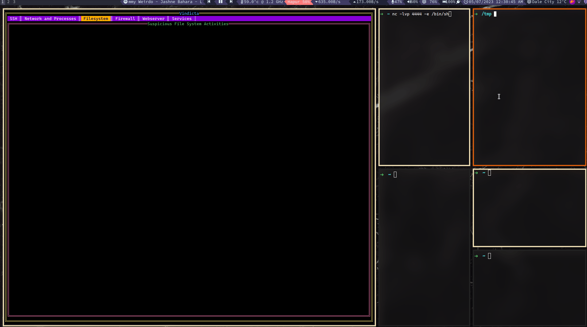

# Vindicta
Blue Team Monitoring Tool For Linux that runs within a Terminal

# Install and Run
Install golang
https://go.dev/doc/install
```
rm -rf /usr/local/go && tar -C /usr/local -xzf go1.20.4.linux-amd64.tar.gz
export PATH=$PATH:/usr/local/go/bin
echo "PATH=$PATH:/usr/local/go/bin" >> ~/.bashrc 
go version
```
*Note: .bashrc should be replaced with your current terminal(echo $SHELL), ex: .zshrc*

Install Vindicta 
```
git clone https://github.com/MasonCompetitiveCyber/vindicta.git
cd vindicta
```
Run Vindicta
```
go mod tidy
go run main.go
```

# Demo



# Structure
```
1. The Main TUI App is TabbedPanels Layout and the library used is https://code.rocketnine.space/tslocum/cview
2. Code for each Tab's UI and function is placed under monitor package
```

# ToDo List:

Work to be done are listed below:

## Todo

For gathering information in real time and rendering it in the app, concurrency might be involved.
Once this phase is solved, we can implement same idea for other items in the Todo list below.
- [x] Find a way to display ssh logs on real time to the app
- [x] Integrate output of `Fsnotify` golang library to the app for filesystem changes notfications
- [ ] Take file paths to monitor as user input from Form. Currently pressing `Shift 3` asks for path. Need to have a function to handle the input paths.
- [x] Read Firewall configuration and display it on the app `Finished, but layout needs improvement`
- [ ] Add, delete, and edit Firewall rules from within the app
- [ ] Read Web Server Logs and display it on the app
- [x] Keep a track of network connections and display it on the app
- [x] Gather suspicious processes and monitor their path in real time. `Halfway Done`
- [ ] Detect Scanning and Monitor suspicious IP addresses and Processes
- [ ] List of Important Services and Their Status (Up / Down)


## Resource
- https://www.loggly.com/ultimate-guide/linux-logging-basics/
- https://www.digitalocean.com/community/tutorials/how-to-view-and-configure-linux-logs-on-ubuntu-debian-and-centos
- https://access.redhat.com/documentation/en-us/red_hat_enterprise_linux/6/html/security_guide/chap-system_auditing
- https://documentation.suse.com/sles/12-SP4/html/SLES-all/cha-audit-comp.html
- https://www.digitalocean.com/community/tutorials/how-to-use-journalctl-to-view-and-manipulate-systemd-logs
- https://access.redhat.com/documentation/en-us/red_hat_enterprise_linux/7/html/security_guide/sec-defining_audit_rules_and_controls
- https://geekflare.com/tcpdump-examples/
- https://sysdig.com/blog/file-integrity-monitoring/
- https://www.tutorialspoint.com/linux-process-monitoring#:~:text=In%20Linux%2C%20Top%20command%20is,regularly%20by%20this%20Top%20command.
- https://www.opensourceforu.com/2018/10/how-to-monitor-and-manage-linux-processes/
