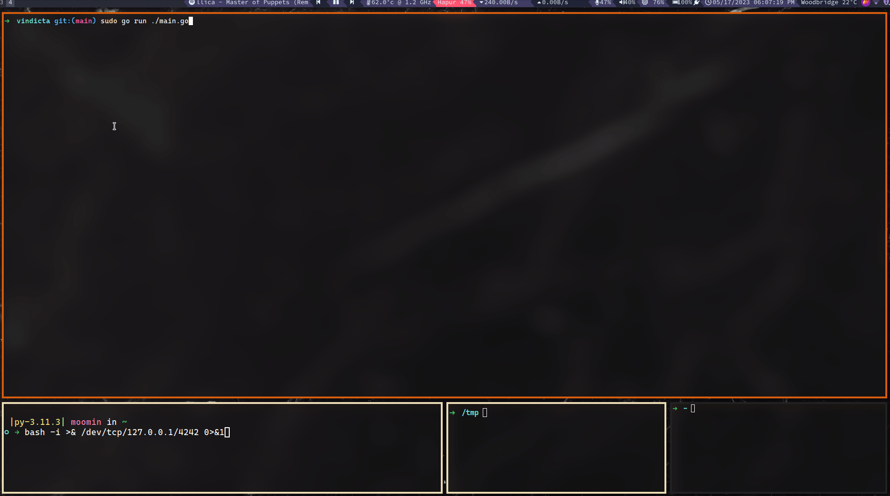

# Vindicta
Blue Team Monitoring Tool For Linux that runs within a Terminal

# Install and Run
Download binary directly from releases and run it.

# Build and Run
- Install Golang
```
https://go.dev/doc/install
```
- Install Vindicta 
```
git clone https://github.com/MasonCompetitiveCyber/vindicta.git
cd vindicta
```
- Build and Run Vindicta
```
go mod tidy
go build .
./vindicta
```

# Demo



# Structure
```
1. The Main TUI App is TabbedPanels Layout and the library used is https://code.rocketnine.space/tslocum/cview
2. Code for each Tab's UI and function is placed under monitor package
```

# ToDo List:

Work to be done are listed below:

## Todo

For gathering information in real time and rendering it in the app, concurrency might be involved.
Once this phase is solved, we can implement same idea for other items in the Todo list below.

#### Main
- [ ] Find a way to disable app.SetInputCapture() while typing in forms.

#### SSH
- [x] Find a way to display ssh logs on real time to the app.

#### Network & Processes
- [x] Keep a track of network connections and display it.
- [x] Gather processes with established network connections and monitor their path in real time.

#### Filesystem
- [x] Integrate output of `Fsnotify` golang library to the app for filesystem changes notifications.
- [x] Take file paths to monitor as user input from Form. Pressing `# key` prompts for path.

#### Firewall
- [ ] Host Based Firewall related stuffs

#### Webserver
- [ ] Read Web Server Logs and display it on the app.

#### Services
- [ ] List of Important Services and Their Status (Up / Down).
